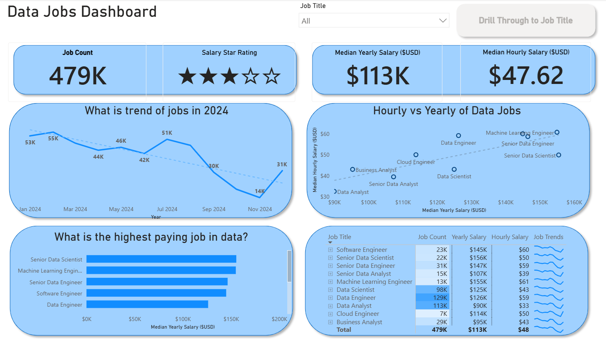
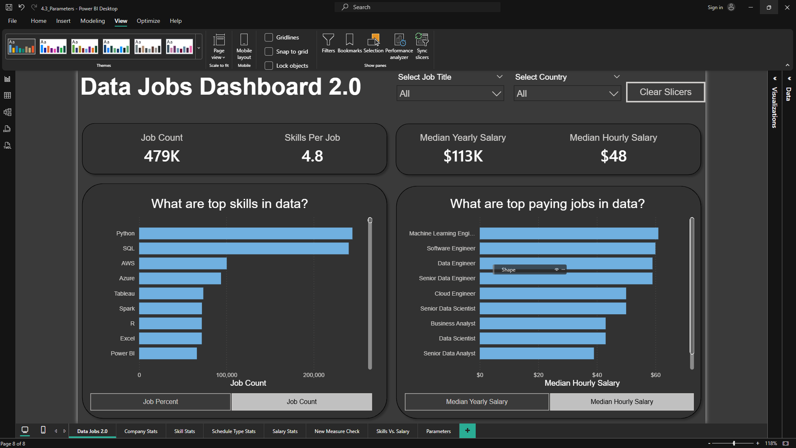

# PowerBI_Data_Analytics_Course
Projects from the PBI Data Analytics Course Luke Barousse

# Featured Dashboards

Explore the dashboards below. Each has its own dedicated README with more details on the build process and specific features.

## Jobs Data Dashboard (V1 - Comprehensive Exploration)

This dashboard provides a comprehensive two-page exploration of the data job market, designed for job seekers. It features a high-level summary page and a detailed drill-through page for specific job titles, offering a broad look at market trends and compensation.

## Key Power BI Skills Utilized:
- **Dashboard Layout and Design**
- **Power Query (ETL & Data Shaping)**
- **Basic Data Modeling (Table Relationships)**
- **Implict Measures & Standard Aggregations**
- **Core Chart (Bar, Line, Area, Column)**
- **Map Visualizatrions for Geospatial Data**
- **KPI Cards & Detailed Data Tables**
- **Interactive Slicers for Filtering**
- **Buttons & Bookmarks for Page Navigation**
- **Drill_Throught Functionality**

[ **View Full Project 1 Details (README)**](Jobs_Data_V1/README.md)

---

## Jobs Data Dashboard 2.0 (V2 - Single-Page Focus)

Version 2.0 of the Jobs Data Dashboard streamlines the analysis into a highly focused, single-page experience. It's optimized to deliver the most critical insights quickly to job seekers, featuring dynamic interactions and more advanced anaytical capabilities.

**Key Power BI Skills Utilized (demonstrating progression):**
* 🎨 Advanced Dashboard Design (Single-Page UX & Optimization)
* ⚙️ Complex Power Query Transformations
* 🔗 Star Schema Data Modeling Principles
* 🧮 Explicit DAX Measures (e.g., `CALCULATE`, context modifiers)
* 📊 Dynamic Visualizations (driven by Parameters/Slicers)
* ⚙️ Field & Numeric Parameter Implementation for "What-If" Analysis
* 🗺️ Enhanced Geospatial Insights
* 🔢 Advanced Card Visualizations
* 🎚️ Optimized Slicers & Advanced Cross-Filtering Techniques
* ✨ Report Performance Considerations

---

## About This Portfolio

Each dashboard linked above has its own detailed `README.md` file within its respective project folder. These offer deeper insights into the project objectives, data sources, specific Power BI techniques employed, and a closer look at the dashboard build.